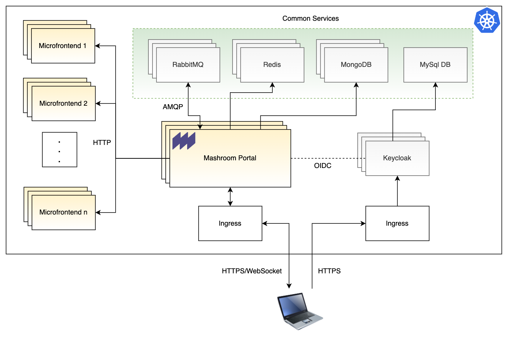

# Creating a Microfrontend Platform with Mashroom Portal on Kubernetes

This document describes a production ready concept for a Microfrontend platform based
on [Mashroom Portal](https://mashroom-server.com) and [Kubernetes](https://kubernetes.io).

The repo contains scripts to setup the complete platform within seconds on [Google Kubernetes Engine](https://cloud.google.com/kubernetes-engine).
But it can of course be deployed on every Kubernetes cluster similarly.

## The platform

### Features

The platform allows it to deploy each Microfrontend separately and to make it **automatically** available in the Portal,
so it can be placed on arbitrary pages.

Highlights:

 * Automatic discovery of newly deployed (Mashroom Portal compliant) Microfrontends
 * High Availability: All building blocks are stateless and can be scaled horizontally
 * Support for server side messaging: The Microfrontends can not only use the *MessageBus* to exchange messages on the same page
   but also with other users and 3rd party systems

### Building blocks

The outlined platform consists of:

 * A *Kubernetes* cluster
 * A [Mashroom Portal](https://mashroom-server.com) for the Microfrontend integration with the following plugins:
     * @mashroom/mashroom-storage-provider-filestore
     * @mashroom/mashroom-security-provider-simple (simple JSON credential store)
     * @mashroom/mashroom-portal-remote-app-registry-k8s (Microfrontend discovery)
     * @mashroom/mashroom-session-provider-redis
     * @mashroom/mashroom-websocket
     * @mashroom/mashroom-messaging
     * @mashroom/mashroom-messaging-external-provider-amqp
 * A [Redis](https://redis.io/) cluster for Portal session storage
 * A [RabbitMQ](https://www.rabbitmq.com/) as message broker
 * A block storage (e.g. an external NFS store) for the Portal configuration
 * A bunch *Mashroom Portal* compliant of Microfrontends

## Setup Guides

 * [Manual Setup Guide](SETUP_MANUAL.md)
 * [Setup Guide for Google Cloud Platform](SETUP_GCP.md)

## Notes

 * Typically there would be an Identity Provider, either the existing one of your company or for example a [Keycloak](https://www.keycloak.org/)
   as part of the platform. Either way, you need to write a security provider plugin to connect it to the *Mashroom Server*
   (A OpenID Connect security provider is on the [Mashroom Roadmap](https://github.com/nonblocking/mashroom/blob/master/ROADMAP.md))
 * Instead of an external NFS store you might consider a cloud native store such as [Gluster](https://www.gluster.org/) or [StorageOS](https://storageos.com/).
   You could also store the Portal configuration in a database like [mongoDB](https://www.mongodb.com/) but then you have to write a new
   storage provider plugin (A mongoDB storage provider is also on the [Mashroom Roadmap](https://github.com/nonblocking/mashroom/blob/master/ROADMAP.md))
 * A CI/CD pipeline to deploy the Portal and the Microfrontends automatically after code changes.
   You could deploy Jenkins on the cluster, install [Spinnaker](https://www.spinnaker.io/)
   or use a Cloud service such as [Google Cloud Build](https://github.com/marketplace/google-cloud-build)
 * You should use namespaces to separate common stuff such as Redis from your Microfrontends
 * The Ingress should be used for SSL/TLS termination (and maybe name based virtual hosts)

