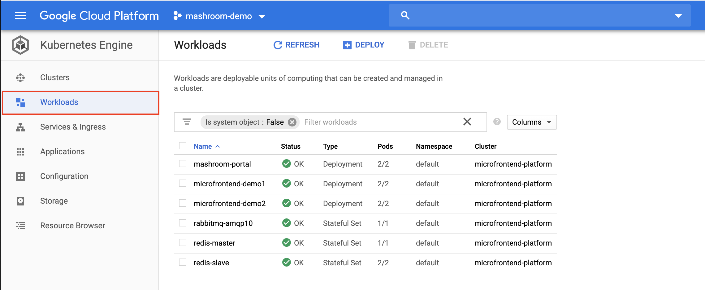
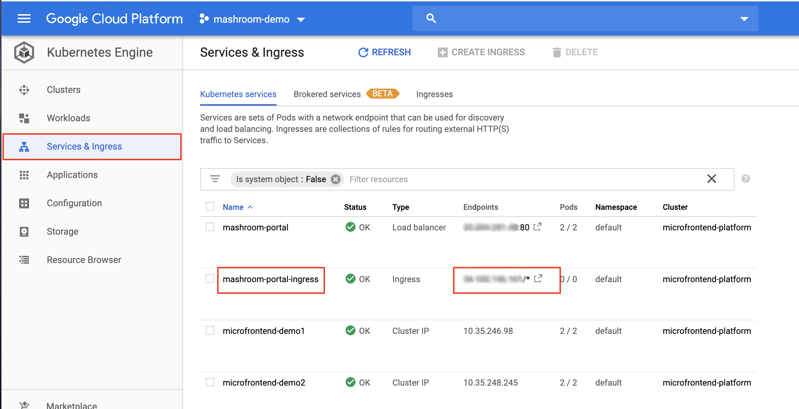

# Setup on Google Kubernetes Engine

## Requirements

Create a [GCP](https://cloud.google.com/) account and:

 * Create a new project
 * Enable Kubernetes Engine

Then install locally:

 * [gcloud](https://cloud.google.com/sdk)
 * kubectl

        gcloud components install kubectl

 * [docker](https://www.docker.com)
 * [helm](https://helm.sh/)
 * [envsub](https://github.com/danday74/envsub)

And add at least the following Helm repos:

    helm repo add stable https://charts.helm.sh/stable
    helm repo add codecentric https://codecentric.github.io/helm-charts
    helm repo add bitnami https://charts.bitnami.com/bitnami

Init the gcloud CLI:

    gcloud init

## Clone this repo

    git clone https://github.com/nonblocking/microfrontend-platform-kubernetes.git
    cd microfrontend-platform-kubernetes

##  Adapt the environment variables

Edit **gcp/set-env.sh** according to your GCP settings and needs.

At very least you should set:

 * *PROJECT_ID* -> this is the Project ID in GCP
 * *ZONE* -> The zone in which the cluster should be created (this also affects the billing)

## Setup the cluster and common services

    ./gcp/setup-gcp-cluster.sh

## Setup Keycloak Realm

Wait until

    kubectl get pods keycloak-0

shows Ready 1/1. Then execute:

    ./keycloak/gcp/setup-mashroom-realm.sh

## Deploy the Mashroom Portal

    ./portal/kubernetes/gcp/deploy.sh

## Deploy the Microfrontends

     ./microfrontend-demo1/kubernetes/gcp/deploy.sh
     ./microfrontend-demo2/kubernetes/gcp/deploy.sh

## Check if the platform is up and running

 * Open the GCP console and navigate to *Kubernetes Engine* -> *Worksloads*. You
   should see something like this:
   
 * Switch to the *Services & Ingress* and click on the endpoint URL in the *mashroom-portal-ingress* row
   -> The Keycloak login mask should appear
   
 * Login as admin/admin
 * On an arbitrary page click *Add App*, search for *Microfrontend Demo1* and add via Drag'n'Drop:
   
 * You can check the registered Microfrontends on http://<ingress-ip>/portal-remote-app-registry-kubernetes
   
 * To check the messaging add the *Mashroom Portal Demo Remote Messaging App* (as admin) to a page,
   open the same page as another user (john/john) and send as *john* a message to *user/admin/test* -
   it should appear in the other users *Demo Remote Messaging App*
 * You can also check if all portal replicas are subscribed to the message broker. The RabbitMQ Admin UI can
   be made locally available with:

        kubectl port-forward --namespace default svc/rabbitmq-amqp10 15672:15672

   After opening http://localhost:15672 and logging in you should be able to see the bindings on the *amqp.topic* exchange:
   
 * To add new users: Find the *keycloak-ingress* address and open it in a browser. Click on *Administration Console* and log
   in as admin/test (or whatever you've set as admin credentials in *set-env.sh*)
 * The Prometheus metrics will be available on http://<ingress-ip>/metrics. If you open this URL you should see something like this:
   
