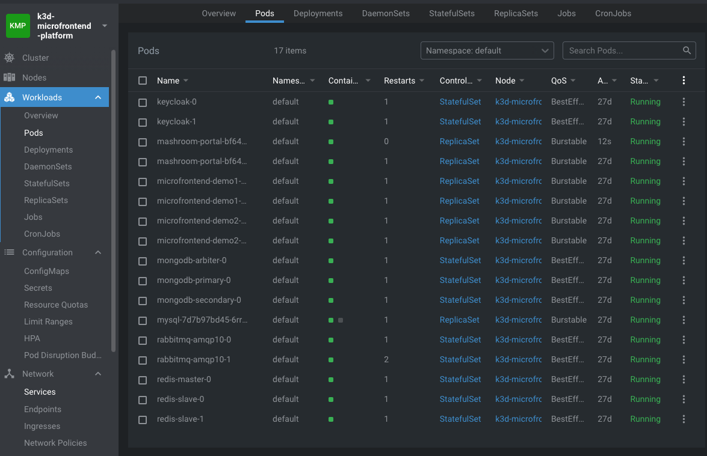
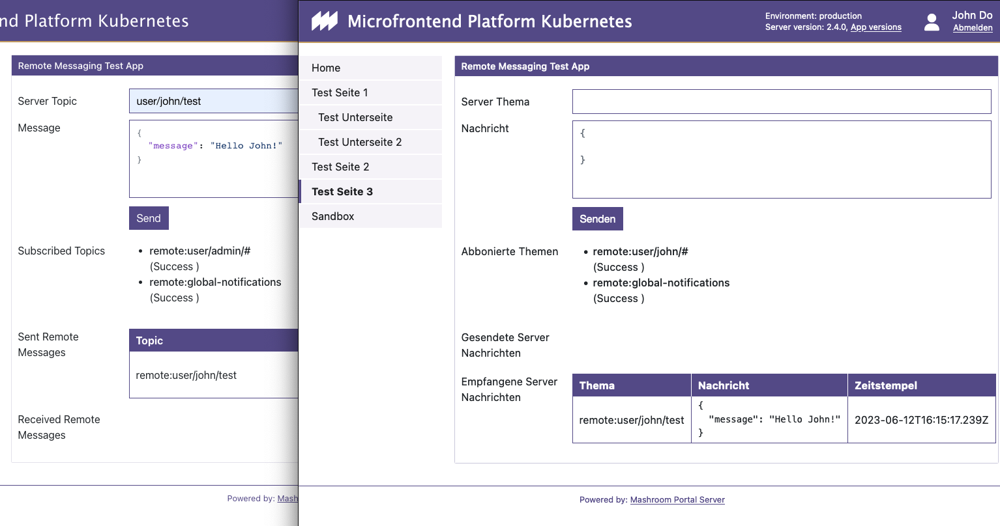

# Setup on K3D

This describes how to set up such a platform with [k3d](https://k3d.io) for local testing and development.

If you use any other technology to run a k8s cluster please follow the [Setup K8S manually Guide](SETUP_K8S_MANUAL.md).

## Requirements

- [k3d](https://k3d.io)
- [kubectl](https://kubernetes.io/de/docs/tasks/tools/install-kubectl/)
- [helm](https://helm.sh/)
- [envsub](https://github.com/danday74/envsub)

**IMPORTANT NOTE**: All scripts are only tested on Linux and macOS, but they also should work with any BASH emulation on Windows.

## Create a new cluster and setup the Microfrontend platform

    ./k3d/setup-mashroom-cluster.sh

This creates a new Kubernetes cluster, sets up the common services and deploys the *Mashroom Portal*
with two demo Microfrontends.

After the script finishes the Portal should now be available under http://localhost:30082,
and you should be able to add *Microfrontend Demo1* and *Microfrontend Demo2* to any page.

## Re-Deploy the Mashroom Portal

    ./portal/kubernetes/k3d/build-and-deploy.sh

## Re-Deploy the Microfrontends

    ./microfrontend-demo1/kubernetes/k3d/build-and-deploy.sh
    ./microfrontend-demo2/kubernetes/k3d/build-and-deploy.sh

## Check if the platform is up and running

- Install [Lens](https://k8slens.dev/) or a similar tool, connect to the cluster and check the workloads:
  
- Enter http://localhost:30082 in your browser
- Login with admin/admin
- On an arbitrary page click _Add App_, search for _Microfrontend Demo1_ and add via Drag'n'Drop:
  
- You can check the registered Microfrontends on http://localhost:30082/portal-remote-app-registry-kubernetes
  
- To check the messaging add the _Mashroom Portal Demo Remote Messaging App_ (as admin) to a page, open the same page as
  another user (john/john) and send as _john_ a message to _user/admin/test_ - it should appear in the other users _Demo
  Remote Messaging App_
  
- The Keycloak Admin UI will be at http://localhost:30081
- The Prometheus metrics will be available on http://localhost:30082/metrics. If you open this URL you should see
  something like this:
  
- If you want access other internal service use kubectl port-forward. E.g. for Redis:

        kubectl port-forward --namespace mashroom-common  svc/redis-master 6380:6379

## Cleanup

    k3d cluster stop mashroom-cluster
    k3d cluster delete mashroom-cluster
