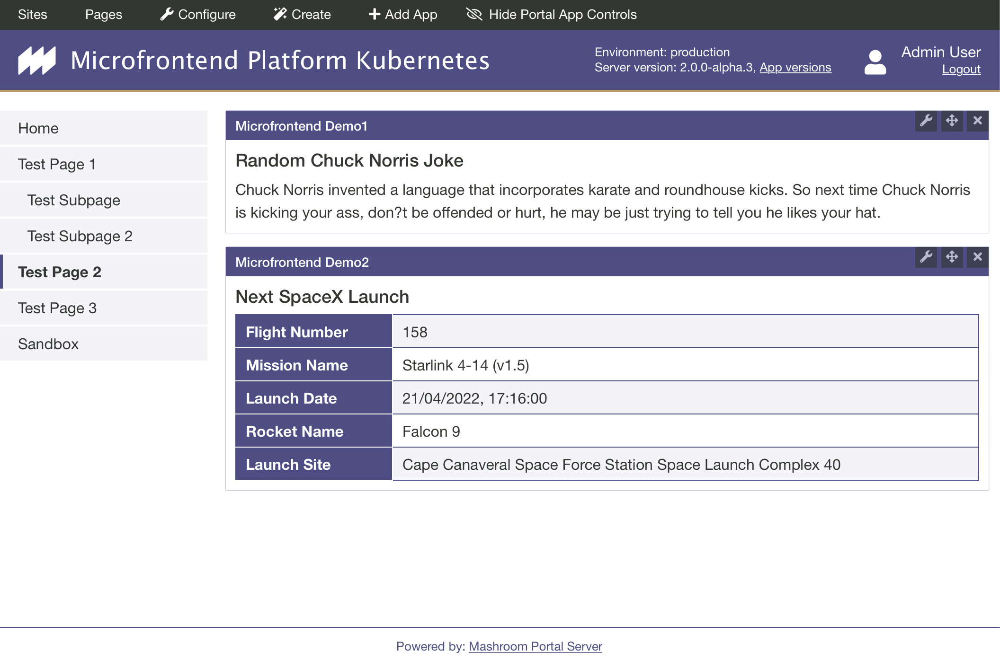
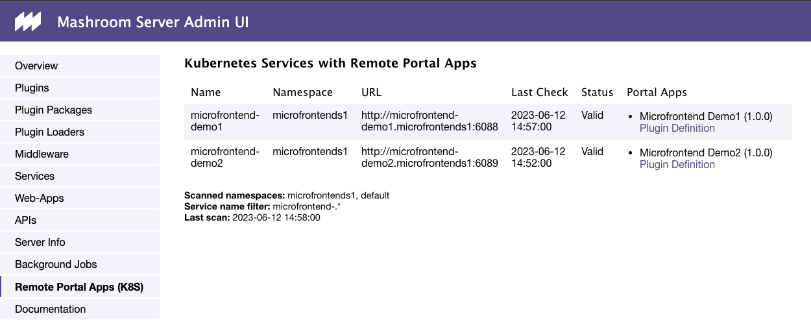
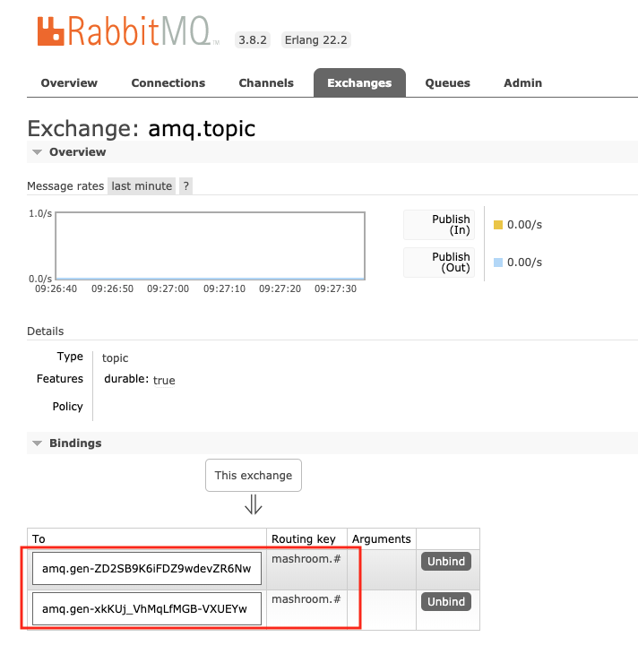
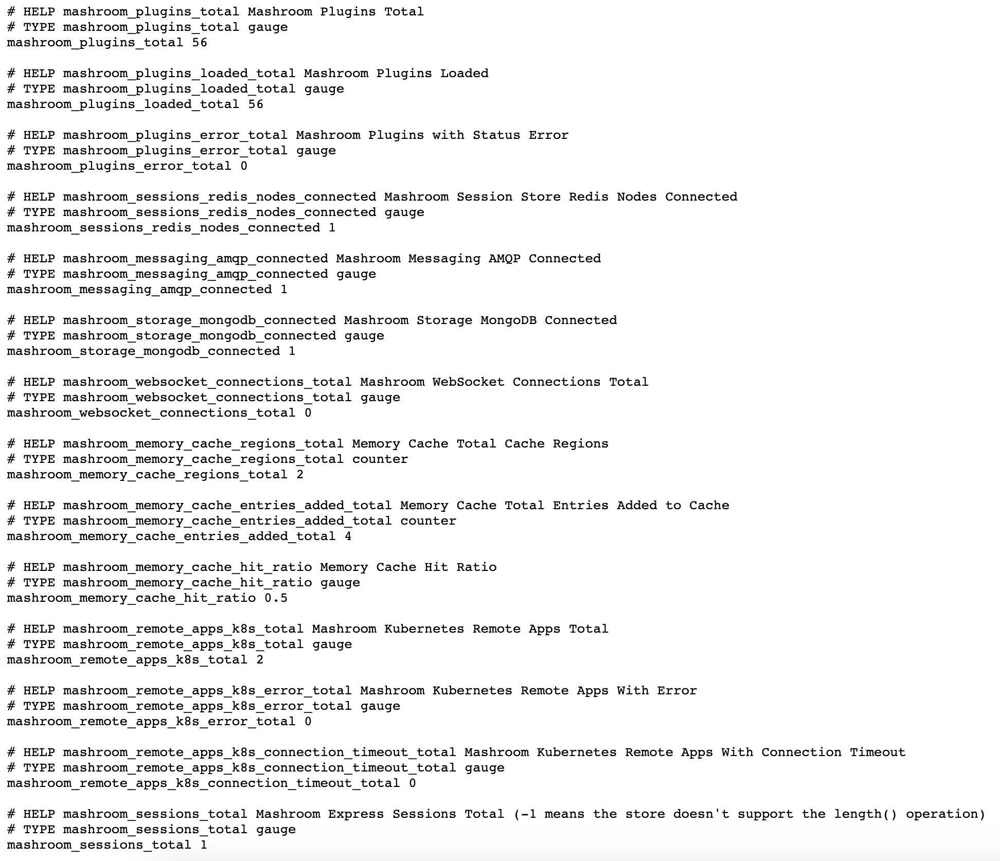

# Manual Setup Guide

This describes how to setup such a platform manually on an arbitrary Kubernetes cluster.

If you use the *Google Kubernetes Engine* use the [GCP Setup Guide](SETUP_GCP.md) which is much simpler.

## Requirements

### Installed

 * kubectl (installed and configured)
 * [docker](https://www.docker.com)
 * [helm](https://helm.sh/)

And add at least the following Helm repos:

    helm repo add stable https://charts.helm.sh/stable
    helm repo add codecentric https://codecentric.github.io/helm-charts
    helm repo add bitnami https://charts.bitnami.com/bitnami

### Static IP addresses/Domains

You need two static IP addresses to expose Keycloak and the Portal.
In this document the placeholders *PORTAL_IP* and *KEYCLOAK_IP* will be used.

## Setup the common services

### Redis

    helm install redis --set usePassword=false bitnami/redis

### RabbitMQ

    helm install rabbitmq-amqp10 \
      --version "6.17.5" \
      --set replicas=2,rabbitmq.username=<username>,rabbitmq.password=<password>,rabbitmq.plugins="rabbitmq_management rabbitmq_peer_discovery_k8s rabbitmq_amqp1_0" \
      bitnami/rabbitmq

### MongoDB

    helm install mongodb \
      --version "7.8.8" \
      --set replicaSet.enabled=true,mongodbDatabase=<portal_db_name>,mongodbUsername=<portal_db_user>,mongodbPassword=<portal_db_password**> \
      bitnami/mongodb

### MySQL

    helm install mysql \
      --version "1.6.9" \
      --set replicaSet.enabled=true,mysqlDatabase=<keycloak_db_name>,mysqlUser=<keycloak_db_user>,mysqlPassword=<keycloak_db_password> \
        stable/mysql

### Keycloak

#### Deployment

Adapt the *keycloak/value.yaml* for your needs.

    helm install keycloak \
      --version "8.3.0" \
      -f keycloak/values.yaml \
      --set keycloak.persistence.dbName=<keycloak_db_name>,keycloak.persistence.dbUser=<keycloak_db_user>,keycloak.persistence.dbPassword=<keycloak_db_password>,\
    keycloak.persistence.dbHost=mysql.default,keycloak.persistence.dbPort=3306,keycloak.username=<keycloak_admin_user>,keycloak.password=<keycloak_admin_password> \
      codecentric/keycloak

#### Ingress

You can use *keycloak/keycloak-ingress.yaml* as a template and than install it like this:

    kubectl apply -f keycloak-ingress.yaml

#### Setup Realm

 * Login to Keycloak and setup a new Realm and a OpenID connect client
 * Enter https://<PORTAL_IP>/* as allowed redirect url
 * In the *Settings* tab set Access Type *confidential*
 * In the *Credentials* tab you'll find the client secret
 * To map the roles to a scope/claim goto _Mappers_, click *Add Builtin* and add a *realm roles* mapper.
   In the field *Token Claim Name* enter *roles*. Also check *Add to ID token*.
 * Add a role *mashroom-admin*
 * Add a bunch of users and give some of them the admin role

### Create a ConfigMap with the platform common services

```yaml
echo "apiVersion: v1
kind: ConfigMap
metadata:
  name: platform-services
  namespace: default
data:
  REDIS_HOST: redis-master.default
  REDIS_PORT: '6379'
  RABBITMQ_HOST: rabbitmq-amqp10.default
  RABBITMQ_PORT: '5672'
  RABBITMQ_USER: $RABBITMQ_USER
  MONGODB_CONNECTION_URI: mongodb://<portal_db_user>:<portal_db_password>@mongodb-primary-0.mongodb-headless.default:27017,mongodb-secondary-0.mongodb-headless.default:27017/<portal_db_name>?replicaSet=rs0
  KEYCLOAK_URL: https://<KEYCLOAK_IP>
```

## Deploy the Mashroom Portal

### Create a service account

It must have the permission to fetch all services for the namespace with the Microfrontends.

```yaml
apiVersion: v1
kind: ServiceAccount
metadata:
    name: mashroom-portal
    namespace: default
---
apiVersion: rbac.authorization.k8s.io/v1
kind: ClusterRole
metadata:
    name: list-services-cluster-role
rules:
    -   apiGroups:
            - ""
        resources:
            - services
        verbs:
            - get
            - list
---
apiVersion: rbac.authorization.k8s.io/v1
kind: RoleBinding
metadata:
    name: mashroom-portal-role-binding
    namespace: default
subjects:
    -   kind: ServiceAccount
        name: mashroom-portal
roleRef:
    kind: ClusterRole
    name: list-services-cluster-role
    apiGroup: rbac.authorization.k8s.io
```

### Create a docker image

    cd portal
    npm install
    docker build -t <your-registry>/mashroom-portal:latest
    docker push <your-registry>/mashroom-portal:latest

### Deploy on Kubernetes:

You can use

 * portal/kubernetes/mashroom-portal-deployment_template.yaml
 * portal/kubernetes/mashroom-portal-service.yaml
 * portal/kubernetes/mashroom-portal-ingress.yaml

as template and adapt it to your needs. Important is:

 * Don't forget to add correct PORTAL_URL environment variable (the public URL!)
 * Add the *serviceAccountName*

## Deploy the Microfrontends

To deploy microfrontend-demo1 (microfrontend-demo2) can be deployed similar:

### Create a docker image

    cd microfrontend-demo1
    npm install
    npm run build
    docker build -t <your-registry>/microfrontend-demo1:latest
    docker push <your-registry>/microfrontend-demo1:latest

### Deploy on Kubernetes:

You can use

 * portal/microfrontend-demo1/microservice-demo1-deployment_template.yaml
 * portal/microfrontend-demo1/microservice-demo1-service.yaml

as template and adapt it to your needs.

## Check if the platform is up and running

 * Enter https://<PORTAL_IP> in your browser
 * Login as admin user
 * On an arbitrary page click *Add App*, search for *Microfrontend Demo1* and add via Drag'n'Drop:
   
 * You can check the registered Microfrontends on http://<ingress-ip>/portal-remote-app-registry-kubernetes
   
 * To check the messaging add the *Mashroom Portal Demo Remote Messaging App* (as admin) to a page,
   open the same page as another user (john/john) and send as *john* a message to *user/admin/test* -
   it should appear in the other users *Demo Remote Messaging App*
 * You can also check if all portal replicas are subscribed to the message broker. The RabbitMQ Admin UI can
   be made locally available with:

        kubectl port-forward --namespace default svc/rabbitmq-amqp10 15672:15672

   After opening http://localhost:15672 and logging in you should be able to see the bindings on the *amqp.topic* exchange:
   
 * The Prometheus metrics will be available on http://<ingress-ip>/metrics. If you open this URL you should see something like this:
   
